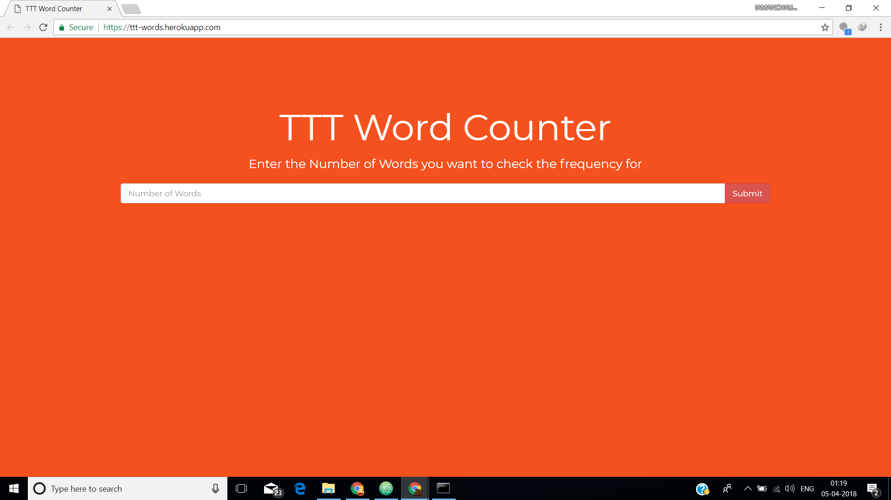
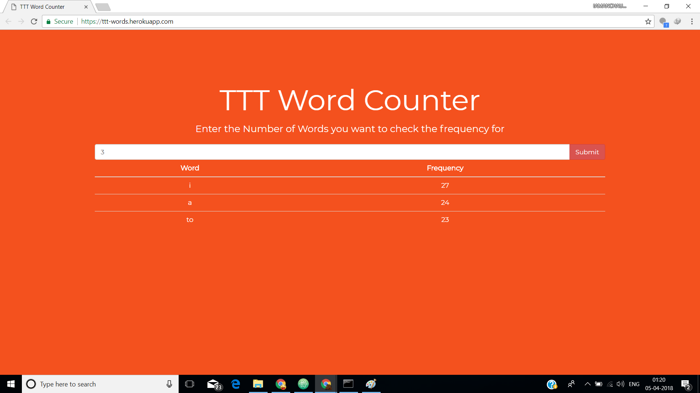
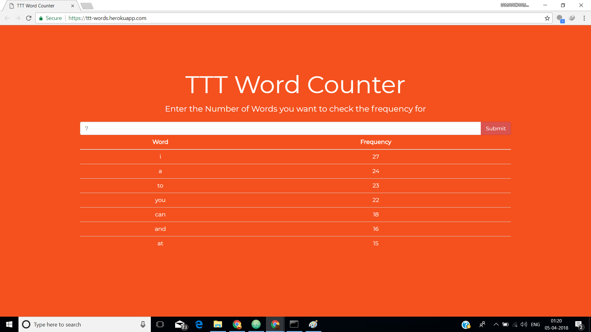
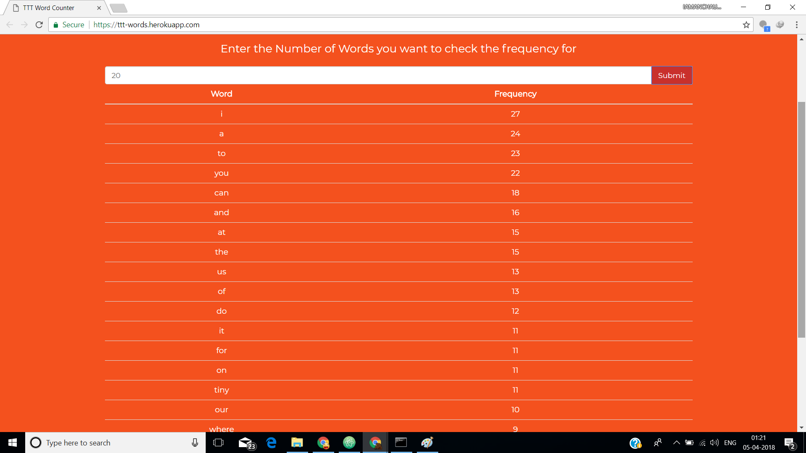

# Check [https://ttt-words.herokuapp.com/](https://ttt-words.herokuapp.com/) for demo

## Backend:
        - Code is written in nodeJS
        - All the ROUTES are create in the "app/routes" directory
        - getandcal.js contains all the code that is getting the data from http://terriblytinytales.com/test.txt, calculating word frequency, sorting the data, and sending it back to the frontend.
        - "/check/:num" is the route used to GET the data from backend to frontend
        - All the Punctuations, Line Breaks, and Tabs are removed from the data received from http://terriblytinytales.com/test.txt and then the data is split with spaces to store it in an array.
        - To calculate the frequency of words, I have used "hasOwnProperty" that checks if a key exists for an array, if it does then increment it's value else add a new key with the new word.
        - Lastly, I created another array that will be sent to the frontend that have the list of the words along with their frequencies.
        
## Frontend:
        - The Frontend is developed with HTML, CSS, and AngularJS.
        - The file is present at app/routes/index.html
        - When the user clicks the Submit button, if the input field is NULL, empty the Table.
        - If the input value is greater than 0, call the nodeJS route and use "ng-repeat" to display the received data in Tabular Form.
        

## Test Cases:

1) Input NULL: 
        The HTML inside the table will be emptied
        

2) Input 0: 
        The HTML inside the table will be emptied
        

3) Input 3: 
        3 rows will be returned and will be added to the Table.
        

4) Input 7: 
        7 rows will be returned and will be added to the Table.
        

5) Input 20: 
        20 rows will be returned and will be added to the Table.
        

6) Input -2: 
        The HTML inside the table will be emptied
        
